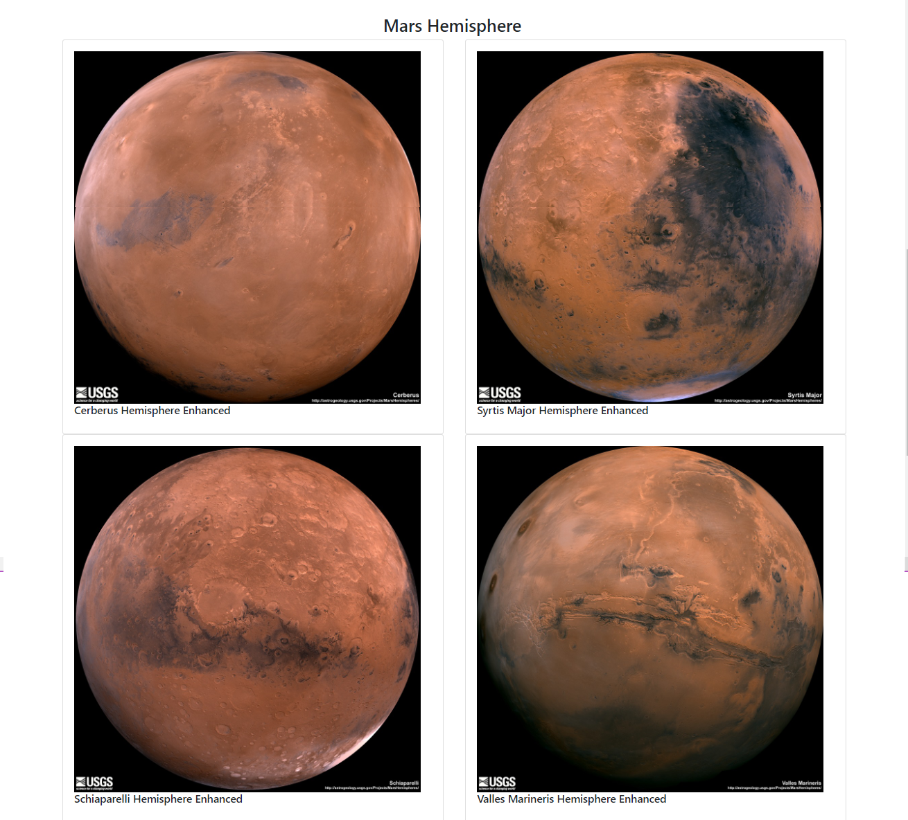

# Web Scraping Challenge
Study Scraping Data from the other websites and generate new website

# Project Name

**Mission to Mars**

# Programs Tools
- Using **Jupyter Notebook** to execute Programs for writing to scrape data from 5 websites.
  - Using **Python and Beautiful Soup** to scrape Latest News from Nasa https://mars.nasa.gov/news
  - Using **Python and Beautiful Soup** toFeatured Space Image from JPL https://www.jpl.nasa.gov/spaceimages/?search=&category=Mars
  - Using **Python and Beautiful Soup** toWeatther from Twitter https://twitter.com/marswxreport?lang=en
  - Using **Panda, and Beautiful Soup** toSpace Facts from Space-Facts https://space-facts.com/mars/
  - Using **Python and Beautiful Soup** toMars Hemispheres from USGS https://astrogeology.usgs.gov/search/results?q=hemisphere+enhanced&k1=target&v1=Mars
- Using **Compass Community** to connect with **Mongo Database** for storing the data from web scraping.
- Using **VS Code** to execute **Flask** for reading data from database and shows in the website.

# Challenges
- While loading data from the website if approached the data to fast can lost some data.
  Slove : Import time and using time.sleep(3).  
- Sending too many requests can cause the website to block the requests.
  Slove : Wait after sending the request before excused the next one.

# Output

