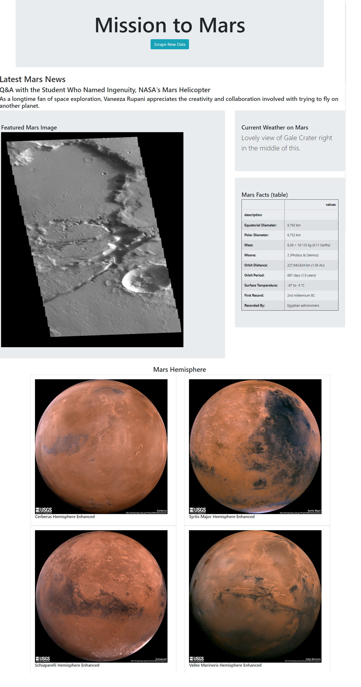

# Web Scraping Challenge
Study Scraping Data from the other websites and generate new website

# Project Name

Mission to Mars

# Programs Tools
- **Jupyter Notebook** for writing to scrape data from 5 websites.
  - Latest News from Nasa https://mars.nasa.gov/news
  - Featured Space Image from JPL https://www.jpl.nasa.gov/spaceimages/?search=&category=Mars
  - Weatther from Twitter https://twitter.com/marswxreport?lang=en
  - Space Facts from Space-Facts https://space-facts.com/mars/
  - Mars Hemispheres from USGS https://astrogeology.usgs.gov/search/results?q=hemisphere+enhanced&k1=target&v1=Mars
- **Mongo Database** for storing the data from web scraping.
- **Flask with Python** for reading data from database and shows in the website.

# Challenges
- While loading data from the website if approached the data to fast can lost some data.
  Slove : Import time and using time.sleep(3).  
- Sending too many requests can cause the website to block the requests.
  Slove : Wait after sending the request before excused the next one.

# Output

